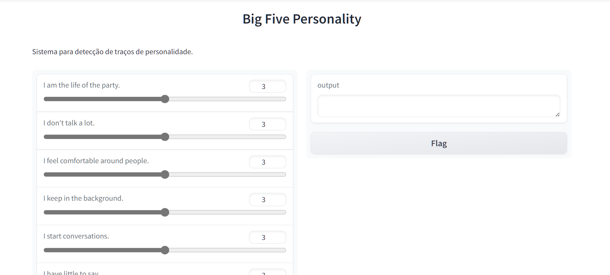

# Detecção de Traços de Personalidade usando Análise de Clusters

Este projeto visa desenvolver um sistema capaz de detectar traços de personalidade em um conjunto de dados usando técnicas de análise de clusters.

## Funcionalidades Principais:

- Análise exploratória dos dados.
- Determinação do número ideal de clusters usando o método Elbow.
- Agrupamento dos dados usando o algoritmo K-means.
- Interface interativa para inserção de dados do usuário e previsão do grupo de personalidade.
- Visualização dos clusters e das características médias de cada grupo.

## Tecnologias Utilizadas:

- Python
- Pandas
- NumPy
- Matplotlib
- Seaborn
- Scikit-learn
- Yellowbrick
- Gradio (para a interface interativa)

## Visualização da Interface:

Aqui está uma captura de tela da interface Gradio em execução:

## Como Usar:

1. Clone este repositório.
2. Certifique-se de ter as dependências instaladas. Use o comando `pip install -r requirements.txt`.
3. Execute o script `main.py` para executar o projeto.
4. Siga as instruções para interagir com a interface e fazer previsões de personalidade.

## Contribuição:

Contribuições são bem-vindas! Para mudanças importantes, abra um problema primeiro para discutir o que você gostaria de mudar.

## Licença:

Este projeto está licenciado sob a licença MIT. Consulte o arquivo [LICENSE](LICENSE) para obter mais detalhes.
